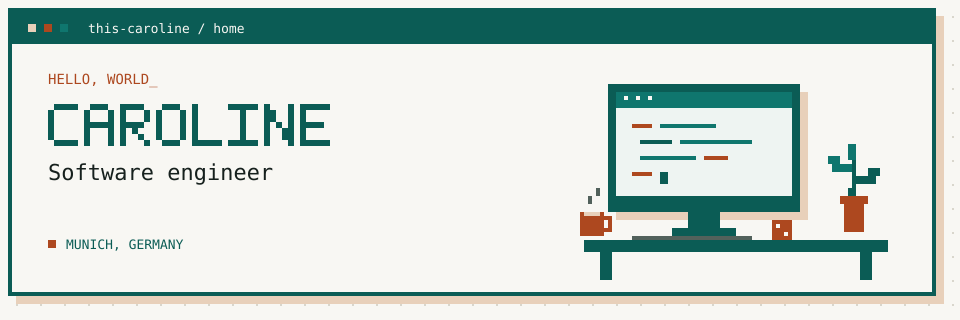

  

  <a href="https://caroline-marques.com">Website & writing</a> ·
  <a href="https://caroline-marques.com/projects">Projects</a> ·
  <a href="https://www.linkedin.com/in/caroline-marquesx">LinkedIn</a>

### Omggg hi :D

I'm yet another software engineer based in Munich

### ▸ Current quests

| On screen | Off screen |
| :--- | :--- |
| Building local AI tools | Bouldering |
| Writing about software & experiments | Board games, learning German, and looking forward to snowboarding season |

### ▸ Explore my corner of the internet

- **[Website & writing](https://caroline-marques.com)** — engineering notes, projects, and experiments.
- **[Personal blog](https://github.com/this-caroline/personal-blog)** — the overengineered code behind my publishing hub.
- **[BoardGameGeek](https://boardgamegeek.com/profile/ex_emo)** — the other kind of building a collection.

---